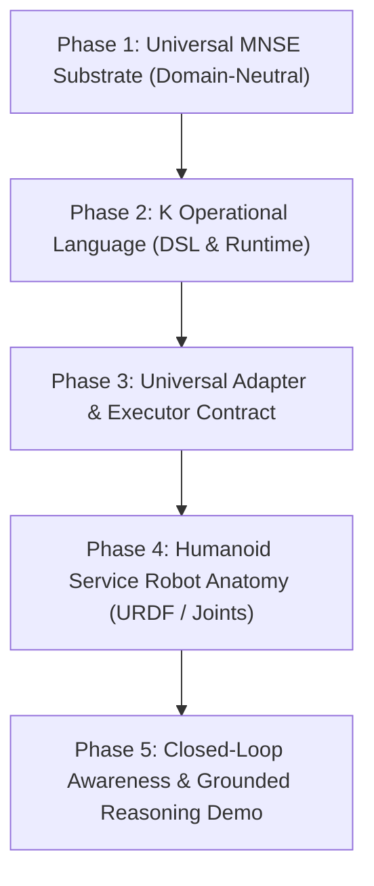

# MNSE & GRaCEmo ViRa — Master Engineering Roadmap

This roadmap defines the sequenced execution phases to establish **MNSE** as the universal context substrate and **GRaCEmo ViRa** as the flagship embodied humanoid robot.

---

## 🗺️ Execution Phases

---

### Phase 1: Universal MNSE Substrate (Domain-Neutral Core)
- **Objective**: Decouple the Rust Kernel from hardcoded robot strings; establish general entity-state and relational models.
- **Key Deliverables**:
  - `InspectorState`: Generic entity-attribute-value map with atomic concurrency.
  - `EventLedger`: Immutable SQLite WAL append-only event store.
  - `GraphStore`: Relational and causal entity connections.
  - `ContextCompiler`: Zero-hallucination context compilation.

---

### Phase 2: K Operational Language Subsystem
- **Objective**: Establish **K** as the deterministic query, composition, and action request DSL.
- **Key Deliverables**:
  - **Query**: `k now <entity>`, `k history <entity> --since <time>`, `k graph <entity>`.
  - **Compose**: Pipelines, record filters, field projections.
  - **Act**: Capability-governed action dispatch (`k action.navigate target="study"`).

---

### Phase 3: Universal Adapter & Executor Contracts
- **Objective**: Establish standard boundaries so any external system (Robot, OS, IoT) can plug into MNSE.
- **Key Deliverables**:
  - `BaseAdapter`: `connect()`, `observe()`, `emit()`.
  - `BaseExecutor`: `execute(action_request)`.

---

### Phase 4: Humanoid Service Robot Anatomy (GRaCEmo ViRa)
- **Objective**: Upgrade the simulated robot body to a full articulated service humanoid on top of our verified base.
- **Key Deliverables**:
  - Sleek Torso & Chest HUD.
  - 2-DOF Pan/Tilt Neck (`neck_yaw`, `neck_pitch`) and stereo camera eyes.
  - Dual 2-DOF Articulated Arms/Hands for social pointing and gestures.
  - Factory-calibrated Center of Mass (CoM) over wheel axle.

---

### Phase 5: Closed-Loop Awareness & Grounded Reasoning
- **Objective**: Full end-to-end integration and research demonstration.
- **Key Deliverables**:
  - Camera $\to$ YOLOv11 $\to$ MNSE $\to$ K $\to$ Context Compiler $\to$ Brain Reasoner $\to$ Speech & Action.
  - Benchmark test: *"Where did you see the laptop yesterday, and what is its status now?"*
